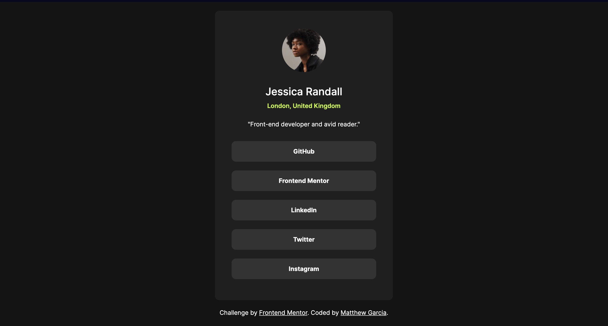

# Frontend Mentor - Social links profile solution

This is a solution to the [Social links profile challenge on Frontend Mentor](https://www.frontendmentor.io/challenges/social-links-profile-UG32l9m6dQ). Frontend Mentor challenges help you improve your coding skills by building realistic projects. 

## Table of contents

- [Overview](#overview)
  - [The challenge](#the-challenge)
  - [Screenshot](#screenshot)
  - [Links](#links)
- [My process](#my-process)
  - [Built with](#built-with)
  - [What I learned](#what-i-learned)
  - [Continued development](#continued-development)
  - [Useful resources](#useful-resources)
- [Author](#author)

**Note: Delete this note and update the table of contents based on what sections you keep.**

## Overview

### The challenge

My challenge was to build out this social links profile and get it looking as close to the design as possible.

Users should be able to:

- See hover and focus states for all interactive elements on the page

### Screenshot



### Links

- [Solution URL](https://www.frontendmentor.io/solutions/short-and-sweet-programming-y-uOANVB2Z)
- [Site URL URL](https://gmatt20.github.io/social-links-profile-main/#)

## My process

### Built with

- Semantic HTML5 markup
- CSS custom properties
- Flexbox
- CSS Grid
- Divs
- Box Model
- Pseudo Class

### What I learned

This is my personal record! I have successfully made this simple project in under 2 hours. I am extremely proud of myself for this accomplishment. I used barely any help and references. I was able to be in a constant flow state which had greatly enriched my coding experience. 

A major thing I learned in CSS is target very specific elements by using the > key. For example, I have this code that only targets all anchor elements that is within the attribution class:

```css
.attribution > a{
    cursor: pointer;
    color: hsl(0, 0%, 100%);
}
```

To further apply this new concept, I have used this concept to for the hover pseudo class and it amazingly worked! For example:

```css
.attribution > a:hover{
    cursor: pointer;
    color: hsl(75, 94%, 57%);
    transition: 0.3s;
}
```

I am extremely proud of applying this concept. This shows that I am learning and adapting qwuickly and I am excited to tackle next projects. I am also understanding the box model by using divs and I have also improved at centering divs and other elements. And as part of my promise from the previous project (blog preview), I have made a general CSS code that is applied to all, rather than over-complicating my code. here is an example:

```css
.card, .profile-pic, .name, .location, .description, .links{
    display: flex;
    align-items: center;
    justify-content: center;
    margin: 20px;
}
```

The result of the project is satisfactory. The code length itself is not too large, it is reasonable and I have made readable code. 

### Continued development

I will need to continue my development on responsive web design. I need to learn the pixel size differences between a computer, phone, and other technologies. I need my project designs to be consistent with every platform. I also want to delve deeper into how I can make my websites accessible. Generally, I shall improve my craft of HTML and CSS before moving onto JS.

### Useful resources

- (https://www.w3schools.com) - As always, W3schools is a lifesaver when it comes to referencing. I have used W3schools to remind myself of specific targeting in CSS and jogging my memory on pseudo-classes.

## Author

- Website - [Matthew Garcia](https://gmatt20.github.io/social-links-profile-main/#)
- Frontend Mentor - [@gmatt20](https://www.frontendmentor.io/profile/gmatt20)
- GitHub - [@gmatt20](https://github.com/gmatt20)